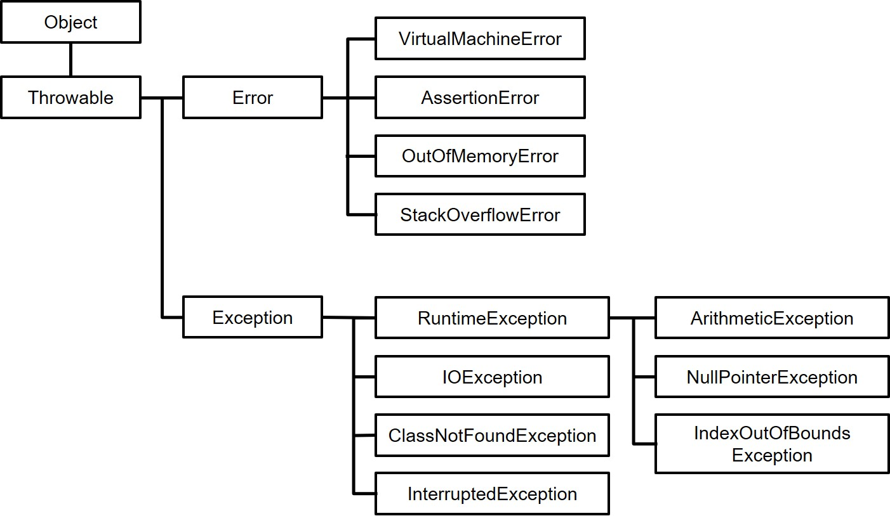

https://docs.oracle.com/javase/specs/jls/se8/html/jls-11.html
## Error vs Exception vs Throwable

### 11.1.1. The Kinds of Exceptions

&nbsp;An exception is represented by an instance of the class `Throwable` (a direct subclass of Object) or one of its subclasses.


&nbsp;The classes `Exception` and `Error` are direct subclasses of `Throwable`.

&nbsp;`Exception` is the superclass of all the exceptions from which <u>ordinary programs may wish to recover.</u>

&nbsp;`Error` is the superclass of all the exceptions from which <u>ordinary programs are not ordinarily expected to recover.</u>

&nbsp;`Error` and all its subclasses are, collectively, the `error classes`.

<center></center>

### 11.1.2. The Causes of Exceptions

&nbsp;An exception is thrown for one of three reasons:

- A `throw` statement (§14.18) was executed.

- An abnormal execution condition was synchronously detected by the Java Virtual Machine, namely:

    - evaluation of an expression violates the normal semantics of the Java programming language (§15.6), such as an integer divide by zero.

    - an error occurs while loading, linking, or initializing part of the program (§12.2, §12.3, §12.4); in this case, an instance of a subclass of LinkageError is thrown.

    - an internal error or resource limitation prevents the Java Virtual Machine from implementing the semantics of the Java programming language; in this case, an instance of a subclass of VirtualMethodError is thrown.

     These exceptions are not thrown at an arbitrary point in the program, but rather <u>at a point where they are specified as a possible result of an expression evaluation or statement execution.</u>

- An asynchronous exception occurred (§11.1.3).

_____
https://docs.oracle.com/javase/tutorial/essential/exceptions/handling.html

## Catching and Handling Exceptions 

There are three exception handler components: `try`, `catch`, and `finally` blocks.

### The try Block

The first step in constructing an exception handler is to enclose the code that might throw an exception within a try block. In general, a try block looks like the following:
```
try {
    code
}
catch and finally blocks . . .
```

The segment in the example labeled `code` contains one or more legal lines of code that could throw an exception. (The `catch` and `finally` blocks are explained in the next two subsections.)

You can put each line of code that might throw an exception within its own try block and provide separate exception handlers for each. Or, you can put all the writeList code within a single try block and associate multiple handlers with it. 
</br>

### The catch Block

You associate exception handlers with a try block by providing one or more catch blocks directly after the try block. No code can be between the end of the try block and the beginning of the first catch block.
```
try {

} catch (ExceptionType name) {

} catch (ExceptionType name) {

}
```
Each `catch` block is an exception handler that handles the type of exception indicated by its argument. The argument type, `ExceptionType`, declares the type of exception that the handler can handle and must be the name of a class that inherits from the `Throwable` class. The handler can refer to the exception with `name`.

The `catch` block contains code that is executed if and when the exception handler is invoked. The runtime system invokes the exception handler when the handler is the first one in the call stack whose `ExceptionType` matches the type of the exception thrown. The system considers it a match if the t`hrown object can legally be assigned to the exception handler's argument.

### The finally Block

The `finally` block <i>always</i> executes when the `try` block exits. This ensures that the `finally` block is executed even if an unexpected exception occurs. But `finally` is useful for more than just exception handling — it allows the programmer to avoid having cleanup code accidentally bypassed by a `return`, `continue`, or `break`. Putting cleanup code in a `finally` block is always a good practice, even when no exceptions are anticipated.


Important: The finally block is a key tool for preventing resource leaks. When closing a file or otherwise recovering resources, place the code in a finally block to ensure that resource is always recovered. 

_____
https://stackoverflow.com/questions/3794910/difference-between-try-catch-and-throw-in-java?lq=1
## Difference between try-catch and throw in java

>-   The `try` block will execute a sensitive code which can throw exceptions
>-   The `catch` block will be used whenever an exception (of the type caught) is >thrown in the try block
>-   The `finally` block is called in every case after the try/catch blocks. Even if >the exception isn't caught or if your previous blocks break the execution flow.
>-   The `throw` keyword will allow you to throw an exception (which will break the >execution flow and can be caught in a catch block).
>-   The `throws` keyword in the method prototype is used to specify that your >method might throw exceptions of the specified type. It's useful when you have >checked exception (exception that you have to handle) that you don't want to catch >in your current method.


>In general terms:
>
>The <b>catch</b> block will handle the Exception
>
><b>throws</b> will pass the error to his caller.

____
https://www.geeksforgeeks.org/checked-vs-unchecked-exceptions-in-java/
## Checked vs Unchecked Exceptions in Java

1) <b>Checked</b>: are the exceptions that are <u>checked at compile time</u>. If some code within a method throws a checked exception, then the method <u>must either handle the exception or it must specify the exception using throws keyword</u>.

2) <b>Unchecked</b> : are the exceptions that are not checked at compiled time. In C++, all exceptions are unchecked, so it is not forced by the compiler to either handle or specify the exception. It is up to the programmers to be civilized, and specify or catch the exceptions.
In Java exceptions under Error and RuntimeException classes are unchecked exceptions, everything else under throwable is checked.

____

## Throwable class hierarchy



-   Throwable
    -   Error
        -   AssertionError
        -   LinkageError
            -   BootstrapMethodError
            -   ClassCircularityError
            -   ClassFormatError
                -   UnsupportedClassVersionError
            -   ExceptionInInitializerError
            -   IncompatibleClassChangeError
                -   AbstractMethodError
                -   IllegalAccessError
                -   InstantiationError
                -   NoSuchFieldError
                -   NoSuchMethodError
            -   NoClassDefFoundError
            -   UnsatisfiedLinkError
            -   VerifyError
        -   ThreadDeath
        -   VirtualMachineError
            -   InternalError
            -   OutOfMemoryError
            -   StackOverflowError
            -   UnknownError
    -   Exception
        -   CloneNotSupportedException
        -   InterruptedException
        -   IOException
            -   FileNotFoundException
            -   SocketException
                -   ConnectException
            -   UnknownHostException
        -   ReflectiveOperationException
            -   ClassNotFoundException
            -   IllegalAccessException
            -   InstantiationException
            -   InvocationTargetException
            -   NoSuchFieldException
            -   NoSuchMethodException
        -   RuntimeException
            -   ArithmeticException
            -   ArrayStoreException
            -   ClassCastException
            -   ConcurrentModificationException
            -   EnumConstantNotPresentException
            -   IllegalArgumentException
                -   IllegalThreadStateException
                -   NumberFormatException
            -   IllegalMonitorStateException
            -   IllegalStateException
            -   IndexOutOfBoundsException
                -   ArrayIndexOutOfBoundsException
                -   StringIndexOutOfBoundsException
            -   NegativeArraySizeException
            -   NullPointerException
            -   SecurityException
            -   TypeNotPresentException
            -   UnsupportedOperationException